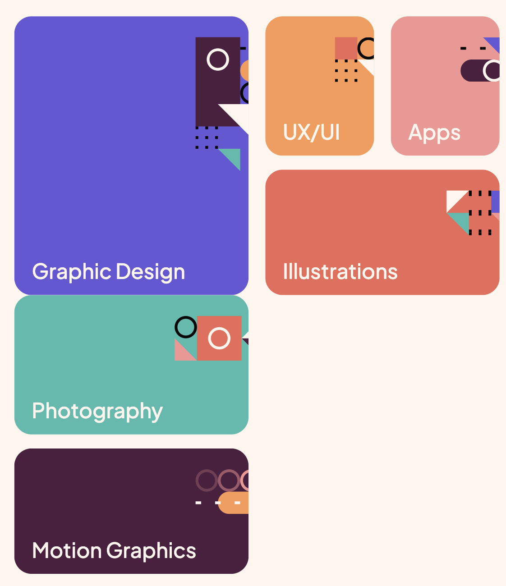
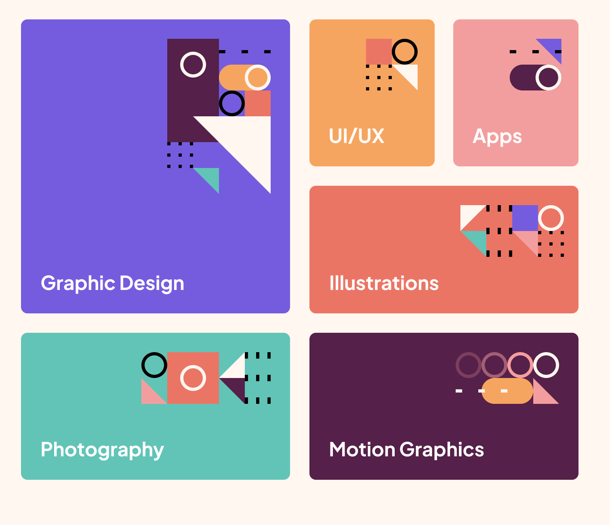

# Frontend Mentor - Single-page design portfolio solution

This is a solution to the [Single-page design portfolio challenge on Frontend Mentor](https://www.frontendmentor.io/challenges/singlepage-design-portfolio-2MMhyhfKVo). Frontend Mentor challenges help you improve your coding skills by building realistic projects. 

## Table of contents

- [Overview](#overview)
  - [The challenge](#the-challenge)
  - [Screenshot](#screenshot)
  - [Links](#links)
- [My process](#my-process)
  - [Built with](#built-with)
  - [What I learned](#what-i-learned)
  - [Continued development](#continued-development)
  - [Useful resources](#useful-resources)
- [Author](#author)

## Overview

### The challenge

Users should be able to:

- View the optimal layout for the site depending on their device's screen size
- See hover states for all interactive elements on the page
- Navigate the slider using either their mouse/trackpad or keyboard

### Screenshot


### Links

- Solution URL: [Solution URL](https://www.frontendmentor.io/solutions/single-page-design-portfolio-using-bootstrap5-_YBiBj9etD)
- Live Site URL: [Live Site](https://j-r77-stack.github.io/Single-page-design-portfolio-bootstrap5/)

## My process

### Built with

- Semantic HTML5 markup
- CSS custom properties
- Mobile-first workflow
- [Bootstrap5](https://getbootstrap.com/) - JS library
- [Google Fonts](https://fonts.google.com/)
- [Git](https://git-scm.com/)
      * Used for version control.
- [GitHub](https://github.com/)
      * Used to store the code once pushed from Git.     


### What I learned

I decided to use Bootstrap5 to build this project as I wanted to practice using it. It helped with certain parts but not with others. I think the design on larger screens looks good and It looks quite good on mobile, however on medium size screens some parts didnt work.

For example the blocks section below. I couldnt work out hwo to get the design layout as it was on frontend mentor.

My design:



Frontend Mentor Design:




I was happy with the way I changed the Bootstrap carousel from 1 image to 3 images for the work section slider feature. Although different from the frontend mentor design I think it turned out really well.

```html
<section>
        <div class="container-fluid" id="work-container">

            <div class="row ">
                <div class="col-12 ">
                    <div>
                        <h2 id="my-work-heading">My Work</h2>
                    </div>
                    <div id="carouselExampleControls" class="carousel slide" data-bs-ride="carousel">
                        <div class="carousel-inner">
                            <div class="carousel-item active">
                                <div class="row">
                                    <div class="col-4">
                                        
                                    </div>
                                    <div class="col-4">
                                        
                                    </div>
                                    <div class="col-4">
                                        
                                    </div>
                                </div>
                            </div>
                            <div class="carousel-item ">
                                <div class="row">
                                    <div class="col-4">
                                        
                                    </div>
                                    <div class="col-4">
                                        
                                    </div>
                                    <div class="col-4">
                                        
                                    </div>
                                </div>
                            </div>
                            <div class="carousel-item">
                                <div class="row">
                                    <div class="col-4">
                                        
                                    </div>
                                    <div class="col-4">
                                        
                                    </div>
                                    <div class="col-4">
                                        
                                    </div>
                                </div>
                            </div>
                        </div>
                        <button class="carousel-control-prev" type="button" data-bs-target="#carouselExampleControls"
                            data-bs-slide="prev">
                            <span aria-hidden="true"> <i class="fas fa-arrow-alt-circle-left fa-5x"></i></span>
                            <span class="visually-hidden">Previous</span>
                        </button>
                        <button class="carousel-control-next" type="button" data-bs-target="#carouselExampleControls"
                            data-bs-slide="next">
                            <span aria-hidden="true"><i class="fas fa-arrow-alt-circle-right fa-5x"></i></span>
                            <span class="visually-hidden">Next</span>
                        </button>
                    </div>
                </div>
            </div>
        </div>
    </section>
```
I'm happy with the css used to create the circular introduction image


```css
#about-left {
    background: url("../images/image-amy.webp") no-repeat center center;
    background-size: cover;
    height: 50%;
    width: 500px;
    height: 500px;
    border-style: solid;
    border-color: #ccc;
    border-width: 1px;
    border-radius: 50%;
}
```

### Continued development

I'd really like to continue practicing with Bootstrap5 in future products to really try to understand the Grid system. Having said that I'd also like to try and use css Grid and flexbox in future projects as I'm still a beginner with them. I didnt use any Javascript with this project except the build in framework with bootstrap, so that is something I really want to use more and more going forward.


### Useful resources

- [w3schools](https://www.w3schools.com/) - A great webpage for someone beginning their journey with code.
- [stackoverflow](https://stackoverflow.com/) - Another very useful site.

## Author

- Frontend Mentor - [@J-R77-stack](https://www.frontendmentor.io/profile/J-R77-stack)
- Linkedin - [@johnny-ramsay](https://www.linkedin.com/in/johnny-ramsay-developer/)


